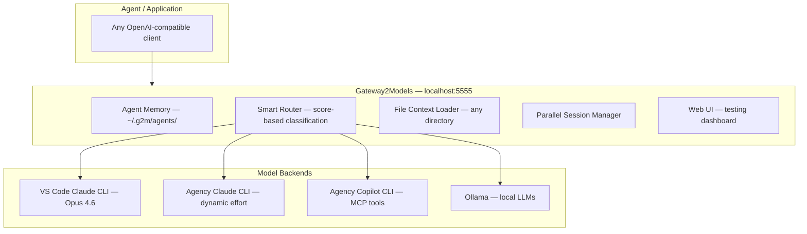

<div align="center">

### ⚡ Gateway2Models

**The Model Gateway for AI Agents**

[GitHub](https://github.com/jackyzou/Gateway2Models) · [Issues](https://github.com/jackyzou/Gateway2Models/issues) · [Agent Guide](./AGENTS.md)

[![][release-shield]][release-link]
[![][github-stars-shield]][github-stars-link]
[![][github-issues-shield]][github-issues-link]
[![][license-shield]][license-link]
[![][last-commit-shield]][last-commit-link]

</div>

---

## Overview

### Challenges in Agent Development

When building AI agents, developers face these challenges:

- **Fragmented Model Access**: Claude CLI, Agency Claude, Copilot CLI, Ollama — each requires different invocation patterns, auth, and APIs.
- **No Unified Interface**: Every model speaks a different protocol. Switching backends means rewriting integration code.
- **Lost Context Between Sessions**: Agents lose memory when sessions end. Conversations, skills, and preferences vanish.
- **No Smart Routing**: Developers manually pick which model to use, instead of letting the system route to the best backend.
- **No Cross-Project Context**: Agents can't access files outside their own workspace without manual setup.

### The Gateway2Models Solution

**Gateway2Models (G2M)** is an open-source **agentware gateway** designed for AI agents and developer tools.

G2M provides a single `localhost:5555` endpoint that any OpenAI-compatible client can use. It intelligently routes requests, maintains persistent agent memory, and loads context from any directory on the machine.

- **Unified OpenAI-Compatible API** → **Solves Fragmentation**: One endpoint for all backends — Claude, Agency, Copilot, Ollama, and more.
- **Persistent Agent Memory** → **Enables Continuity**: Agents register once with skills, goals, and workspace. G2M remembers everything across sessions in `~/.g2m/agents/`.
- **Smart Score-Based Routing** → **Picks the Right Model**: Prompt analysis scores MSFT keywords, task complexity, and code signals to auto-select the best backend.
- **Cross-Directory File Access** → **Provides Full Context**: Load files from any directory on the machine to enrich prompts with real project context.
- **Parallel Session Execution** → **Fan-Out Analysis**: Run the same prompt against multiple models simultaneously and compare results.
- **Dynamic Effort Control** → **Optimizes Cost**: Auto-classify prompt complexity into low/medium/high/max effort levels.
- **Local Model Support** → **Works Offline**: Ollama integration for local LLM inference when internet isn't available.

---

## Quick Start

### Prerequisites

- **Node.js** v20+ and **npm** v9+
- At least one AI backend:
  - Claude CLI (`claude.exe`) — via Anthropic
  - Agency CLI (`agency.exe`) — via Microsoft
  - Copilot CLI (`copilot.exe`) — via GitHub
  - [Ollama](https://ollama.com/) — for local models

### 1. Installation

```bash
git clone https://github.com/jackyzou/Gateway2Models.git
cd Gateway2Models
npm install
```

### 2. Configuration

```bash
cp .env.example .env
# Edit .env to configure CLI paths and Ollama URL
```

### 3. Build & Start

```bash
npm run build
npm start          # → http://127.0.0.1:5555 (localhost only)
```

Or development mode with hot reload:

```bash
npm run dev
```

### 4. Start in LAN Mode (access from all devices on your WiFi)

```bash
npm run start:lan   # → http://0.0.0.0:5555 (all network interfaces)
```

Or set the env variable:

```bash
G2M_LAN=true npm start
```

Once running in LAN mode, access from any device on your network at:
```
http://<your-computer-ip>:5555
```

> **💡 How to find your IP:** Run `ipconfig` (Windows) or `ifconfig` (Mac/Linux) and look for your WiFi adapter's IPv4 address (e.g., `192.168.1.x` or `10.0.0.x`).

#### 📌 Set a Static IP (so the address doesn't change)

To keep G2M accessible at the same address every time:

<details>
<summary><b>Windows</b></summary>

1. Open **Settings → Network & Internet → Wi-Fi → Hardware properties**
2. Click **Edit** next to IP assignment
3. Switch to **Manual**, enable **IPv4**
4. Set:
   - IP address: `10.0.0.139` (or your preferred address)
   - Subnet mask: `255.255.255.0`
   - Gateway: `10.0.0.1` (your router IP)
   - DNS: `8.8.8.8`
5. Save

Or via PowerShell (admin):
```powershell
New-NetIPAddress -InterfaceAlias "Wi-Fi" -IPAddress 10.0.0.139 -PrefixLength 24 -DefaultGateway 10.0.0.1
Set-DnsClientServerAddress -InterfaceAlias "Wi-Fi" -ServerAddresses 8.8.8.8,8.8.4.4
```
</details>

<details>
<summary><b>macOS</b></summary>

1. Open **System Settings → Wi-Fi → Details → TCP/IP**
2. Set **Configure IPv4** to **Manually**
3. Enter your preferred IP, subnet `255.255.255.0`, router IP
</details>

<details>
<summary><b>Router DHCP Reservation (recommended)</b></summary>

The best approach — assign a fixed IP at the router level:

1. Log into your router admin (usually `192.168.1.1` or `10.0.0.1`)
2. Find **DHCP Reservation** or **Address Reservation**
3. Add your computer's MAC address with the desired IP
4. Your computer will always get the same IP from the router
</details>

### 4. Verify

```bash
curl http://localhost:5555/health
curl http://localhost:5555/v1/models
```

Open **http://localhost:5555** for the Web UI.

### 5. Send Your First Request

```bash
curl http://localhost:5555/v1/chat/completions \
  -H "Content-Type: application/json" \
  -d '{
    "model": "auto",
    "messages": [{"role": "user", "content": "Explain TypeScript generics"}],
    "stream": true
  }'
```

### 6. Register an Agent

```bash
curl http://localhost:5555/v1/agents/intake \
  -H "Content-Type: application/json" \
  -d '{
    "agentId": "my-agent",
    "name": "Code Assistant",
    "skills": ["typescript", "code-review"],
    "workspace": {"path": "/projects/myapp"},
    "task": "Review the auth module"
  }'
```

### Docker Deployment

```bash
docker compose up
```

---

## Available Backends

| Model ID | Backend | Engine | Best For |
|----------|---------|--------|----------|
| `vscode-claude` | Claude CLI | Opus 4.6 (1M ctx) | General coding, Q&A, fast inference |
| `agency-claude` | Agency CLI | Opus 4.6 (1M ctx) | Complex tasks, dynamic effort level |
| `agency-copilot` | Copilot CLI | GitHub Copilot | Microsoft ecosystem (ADO, WorkIQ, M365) |
| `ollama` | Ollama API | Local LLMs | Offline use, privacy, fast local inference |
| `auto` | Smart Router | — | **Recommended.** Auto-picks based on content |

---

## Core Concepts

### 1. Unified API → Solves Fragmentation

One OpenAI-compatible endpoint for all backends. Any client that speaks the OpenAI API works.

```python
from openai import OpenAI

client = OpenAI(base_url="http://localhost:5555/v1", api_key="unused")
response = client.chat.completions.create(
    model="auto",
    messages=[{"role": "user", "content": "Hello!"}],
    stream=True,
)
for chunk in response:
    print(chunk.choices[0].delta.content or "", end="")
```

### 2. Persistent Agent Memory → Enables Continuity

Agents register via the **Intake Protocol**. G2M persists profiles and conversations to `~/.g2m/agents/`.

```
~/.g2m/
  agents/
    my-code-reviewer/
      profile.json              # Skills, goals, preferences
      threads/
        abc123.json             # Full conversation history + routing metadata
```

When an agent reconnects — even days later — G2M loads its full profile, previous work, and continues seamlessly.

### 3. Smart Score-Based Routing → Picks the Right Model

When `model: "auto"`, G2M scores the prompt across multiple signals:

| Signal | Score | Routes To |
|--------|-------|-----------|
| MSFT keywords (Azure DevOps, WorkIQ, M365) | Strong: +3, Weak: +1 | `agency-copilot` (≥ 2) |
| Complex tasks (architecture, refactor, multi-file) | +2 per signal | `agency-claude` (≥ 4) |
| Long prompts, code blocks, multi-turn | +1–3 | `agency-claude` |
| Quick/simple tasks | −1 per signal | `vscode-claude` (default) |

Routing metadata returned in `x-routing` response field with confidence scores.

### 4. Cross-Directory File Access → Full Context

Load files from **any directory** — not just the current workspace:

```bash
curl http://localhost:5555/v1/context/load \
  -H "Content-Type: application/json" \
  -d '{"paths": ["/projects/app-a/src", "/docs/spec.md"]}'
```

### 5. Parallel Sessions → Fan-Out Analysis

Run the same question against multiple backends simultaneously:

```bash
curl http://localhost:5555/v1/sessions/parallel \
  -H "Content-Type: application/json" \
  -d '{
    "tasks": [
      {"model": "vscode-claude", "messages": [{"role":"user","content":"Review this code"}]},
      {"model": "ollama", "messages": [{"role":"user","content":"Review this code"}]}
    ],
    "concurrency": 3
  }'
```

### 6. Local Models → Works Offline

Ollama integration for local inference. No internet required.

```bash
ollama serve                    # Start Ollama
curl http://localhost:5555/v1/chat/completions \
  -H "Content-Type: application/json" \
  -d '{"model": "ollama", "messages": [{"role":"user","content":"Hello"}]}'
```

---

## Architecture



---

## All Endpoints

| Endpoint | Method | Description |
|----------|--------|-------------|
| `/` | GET | Web UI |
| `/health` | GET | Server status |
| `/v1/models` | GET | List models |
| `/v1/chat/completions` | POST | Chat (OpenAI-compatible) |
| `/v1/agents/intake` | POST | Register agent + create thread |
| `/v1/agents/chat` | POST | Thread-aware chat with memory |
| `/v1/agents` | GET | List registered agents |
| `/v1/agents/:id` | GET / PUT | Agent profile |
| `/v1/agents/:id/threads` | GET / POST | Agent threads |
| `/v1/agents/:agentId/threads/:threadId` | GET / PUT | Thread details |
| `/v1/context/read` | POST | Read a file |
| `/v1/context/list` | POST | List directory |
| `/v1/context/glob` | POST | Find files by extension |
| `/v1/context/load` | POST | Bulk load context |
| `/v1/context/discover` | POST | Auto-detect project type |
| `/v1/context/git-diff` | POST | Git diff for a directory |
| `/v1/context/sessions` | POST / GET | Context sessions (auto-attribution) |
| `/v1/context/sessions/:id` | GET / PUT | Session details + messages |
| `/v1/context/sessions/:id/messages` | POST | Append message to session |
| `/v1/memories` | POST / GET | Save/list memories |
| `/v1/images/generations` | POST | Image generation |
| `/v1/audio/speech` | POST | Text-to-speech (Fish Speech) |
| `/v1/audio/transcriptions` | POST | Audio transcription |
| `/v1/video/generations` | POST / GET | Video generation (async jobs) |
| `/v1/storage` | POST / GET | File storage (upload/list) |
| `/v1/storage/:id` | GET / DELETE | Retrieve/delete stored file |
| `/v1/storage/stats` | GET | Storage statistics |
| `/v1/sessions/parallel` | POST | Parallel model requests |
| `/v1/sessions` | GET | List sessions |
| `/v1/sessions/:id` | GET | Session details |
| `/v1/tools` | POST / GET | Register/list tools |
| `/v1/router/stats` | GET | Routing analytics |
| `/v1/router/policy` | GET | Routing policy |
| `/v1/cache/stats` | GET | Cache statistics |
| `/v1/lan/policy` | GET / PUT | LAN access policy |

---

## Agent Integration

See **[AGENTS.md](./AGENTS.md)** for the complete guide with SDK examples and patterns.

### Recommended Flow

1. **Intake** → Register with G2M: describe skills, workspace, goals
2. **Chat** → Thread-aware chat: history persists automatically
3. **Context** → Load files from any directory to enrich prompts
4. **Parallel** → Fan-out analysis across multiple models

---

## Configuration

| Variable | Default | Description |
|----------|---------|-------------|
| `G2M_PORT` | `5555` | Server port |
| `G2M_HOST` | `127.0.0.1` | Bind address |
| `G2M_LAN` | `false` | Set `true` to bind to `0.0.0.0` (LAN mode) |
| `G2M_MAX_CONCURRENCY` | `5` | Max concurrent requests |
| `G2M_TIMEOUT_MS` | `300000` | Request timeout |
| `OLLAMA_BASE_URL` | `http://localhost:11434` | Ollama API URL |
| `OLLAMA_MODEL` | `llama3.1` | Default Ollama model |
| `FISH_SPEECH_URL` | `http://localhost:8080` | Fish Speech TTS server |
| `STABILITY_API_KEY` | — | Stability AI key (image gen) |
| `OPENAI_API_KEY` | — | OpenAI key (DALL-E, GPT) |
| `REPLICATE_API_TOKEN` | — | Replicate token (video gen) |
| `COMFYUI_BASE_URL` | `http://localhost:7860` | Local ComfyUI (image gen) |

---

## Contributing

1. Fork the repository
2. Create a feature branch
3. Submit a pull request

## License

MIT

---

[](https://www.star-history.com/#jackyzou/Gateway2Models&Date)

<!-- Link Definitions -->
[release-shield]: https://img.shields.io/github/v/release/jackyzou/Gateway2Models?color=369eff&labelColor=black&logo=github&style=flat-square
[release-link]: https://github.com/jackyzou/Gateway2Models/releases
[license-shield]: https://img.shields.io/badge/license-MIT-white?labelColor=black&style=flat-square
[license-link]: https://github.com/jackyzou/Gateway2Models/blob/master/LICENSE
[last-commit-shield]: https://img.shields.io/github/last-commit/jackyzou/Gateway2Models?color=c4f042&labelColor=black&style=flat-square
[last-commit-link]: https://github.com/jackyzou/Gateway2Models/commits/master
[github-stars-shield]: https://img.shields.io/github/stars/jackyzou/Gateway2Models?labelColor=black&style=flat-square&color=ffcb47
[github-stars-link]: https://github.com/jackyzou/Gateway2Models
[github-issues-shield]: https://img.shields.io/github/issues/jackyzou/Gateway2Models?labelColor=black&style=flat-square&color=ff80eb
[github-issues-link]: https://github.com/jackyzou/Gateway2Models/issues
